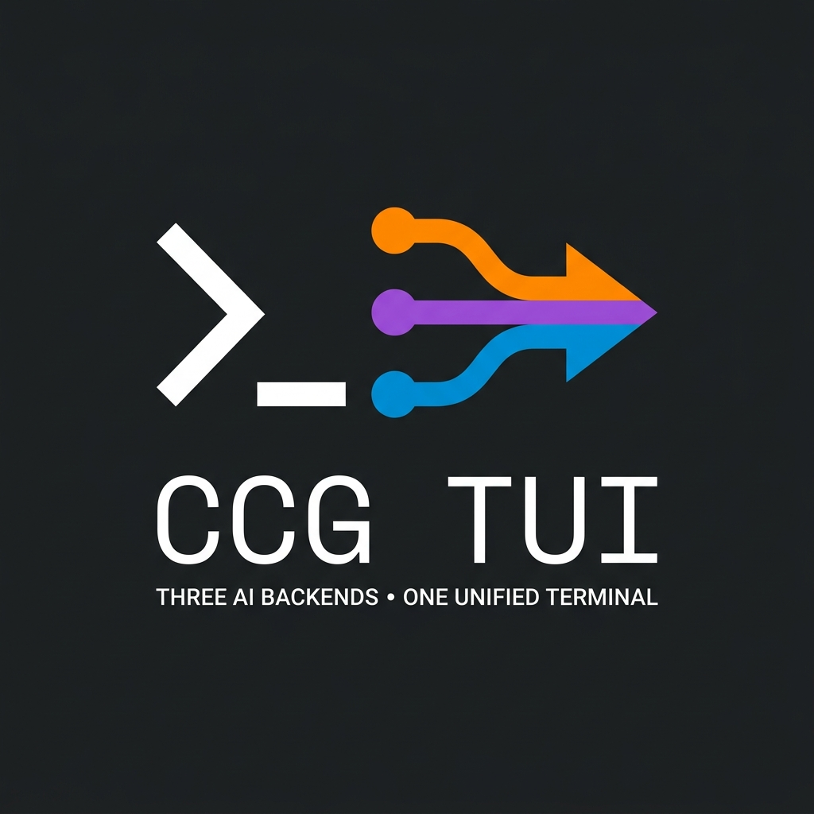
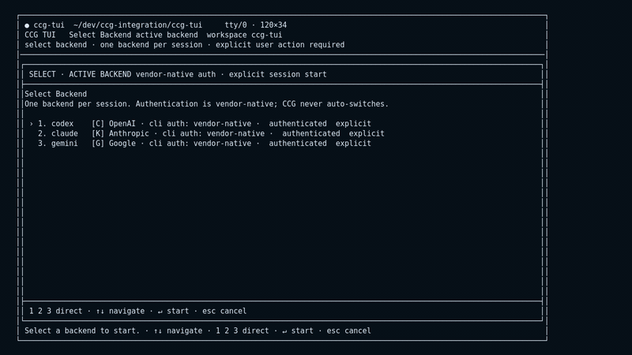

<p align="center">
  
</p>

# CCG TUI

CCG TUI is a vendor-agnostic terminal workspace for developers who use multiple
coding agent CLIs. It lets you run Codex, Claude Code, Gemini CLI, and
Antigravity CLI from one consistent interface while CCG owns the transcript,
local workflow commands, resume context, and cross-backend handoff packets.

The project is useful today as a local operator console, with deliberately
conservative boundaries around automation: CCG can advise on backend fit and
prepare handoff context, but it does not silently switch backend, model, or
permissions.

## 🎥 Demo



The demo shows the fullscreen backend picker, explicit model and permission
control, local task state, normalized backend activity details, a summary
checkpoint, advisory capability registry, and a preview-only Claude handoff
packet. It is recorded with the deterministic fake backend, so it can be
regenerated without Codex, Claude, or Gemini credentials:

```bash
uv run python scripts/record_readme_demo.py
```

## 💡 Why It Exists

Modern coding assistants are strong in different situations. CCG TUI keeps
backend choice operational instead of product-specific: start with the CLI that
fits the task, keep a local transcript that is independent of vendor storage,
and hand off bounded working context when another backend should continue.

## ✨ What Works

- Fullscreen `prompt_toolkit` TUI with backend, model, and permissions pickers.
- One-shot prompt mode and a line-by-line fallback UI.
- Backend adapters for `codex`, `claude`, `gemini`, and `antigravity`.
- Persistent terminal-backed backend sessions where vendor CLIs expose usable
  transcript contracts; Antigravity uses verified `agy --print` mode for CCG
  turns and native terminal handoff for backend-interactive commands.
- Normalized output, activity, failures, vendor session ids, and transcript
  events across supported backends.
- CCG-owned slash commands for status, local history, resume context,
  summaries, capabilities, task boundaries, and handoff preview.
- Backend-native slash-command passthrough with selected compatibility
  translations.
- JSON transcripts under `runtime/transcripts/`.
- Gemini-backed summary checkpoints, with optional Antigravity summary backend
  support when local `agy --print` output is verified.
- First-turn local resume context injection.
- Manual cross-backend handoff packet preview/export and explicit
  target-session execution with lineage metadata.
- Advisory backend capability and permission compatibility notes.

## 🚧 Boundaries

The current implementation intentionally keeps these areas out of scope:

- automatic backend switching
- automatic model or permission changes
- vendor-native cross-backend resume
- product-owned MCP orchestration
- product-owned skills orchestration
- subagent orchestration
- cross-session search

## 🚀 Quick Start

Prerequisites:

- Python 3.12+
- `uv`
- one or more supported vendor CLIs on `PATH`: `codex`, `claude`, `gemini`,
  `agy`
- vendor-native authentication completed in whichever CLIs you plan to use

Antigravity uses the official `agy` launcher. Install it with Google's
installer when it is not already on `PATH`:

```bash
curl -fsSL https://antigravity.google/cli/install.sh | bash
```

Install dependencies:

```bash
uv sync --dev
```

Launch the fullscreen TUI and choose a backend:

```bash
uv run ccg-tui
```

Start directly with a backend:

```bash
uv run ccg-tui --backend codex
uv run ccg-tui --backend claude
uv run ccg-tui --backend gemini
uv run ccg-tui --backend antigravity
```

Run a single prompt:

```bash
uv run ccg-tui --backend codex --prompt "Summarize this repository"
uv run ccg-tui --backend antigravity --prompt "Summarize this repository"
```

Use the simple fallback UI:

```bash
uv run ccg-tui --simple-ui
```

## ⌨️ Interactive Controls

| Input | Behavior |
| --- | --- |
| `Enter` | Submit the current prompt. |
| `Shift-Enter` | Add a newline when the terminal reports modified Enter. |
| `Esc` then `Enter` | Add a newline fallback for terminals without modified Enter support. |
| `Ctrl-J` | Submit fallback for terminals that do not expose modified Enter cleanly. |
| `F2` | Refresh the conversation pane. |
| `F3` or `/details` | Toggle expanded backend activity metadata. |
| `Esc` or `Ctrl-C` | Exit the current session or cancel a picker. |

## ⚡ Slash Commands

CCG routes slash commands through one registry:

| Command group | Examples | Behavior |
| --- | --- | --- |
| Product commands | `/help`, `/quit`, `/clear`, `/model`, `/permissions`, `/status`, `/capabilities`, `/copy`, `/resume` | Handled by CCG before backend prompt submission. |
| Local workflow commands | `/history`, `/details`, `/context`, `/summarize`, `/handoff`, `/task` | Update local state, show local artifacts, or run local actions. |
| Backend commands | `/compact`, `/plan`, `/init`, `/memory`, `/mcp`, `/review` | Translated or passed through to the active backend when appropriate. |

Common aliases include `/exit` for `/quit`, `/new` and `/reset` for `/clear`,
`/commands` for `/help`, `/stats` and `/cost` for `/status`, and `/continue`
for `/resume`.

Task commands manage local task boundaries without sending prompts to the
backend:

```text
/task start [title...]
/task status
/task close [note...]
```

## 🧠 Models And Permissions

Open the in-TUI pickers:

```text
/model
/permissions
```

Or set values directly:

```text
/model gpt-5.5
/model sonnet
/model gemini-2.5-flash
/permissions ask
/permissions plan
/permissions auto-edit
/permissions full-access
```

Model names are examples. Actual availability is controlled by the installed
vendor CLI and the account or project it is authenticated against.
CCG refreshes model choices from the active backend when `/model` opens: Codex
uses `codex debug models`, Claude reads the installed Claude Code model aliases
and local config, Gemini reads the installed Gemini CLI model definitions, and
Antigravity reads the native picker in the background.

The default permission preset is `ask`.

| Preset | Codex | Claude | Gemini | Antigravity |
| --- | --- | --- | --- | --- |
| `plan` | `approval_policy=on-request`, `sandbox_mode=read-only` | `permission_mode=plan` | `approval_mode=plan` | `permission_mode=sandbox` |
| `ask` | `approval_policy=on-request`, `sandbox_mode=workspace-write` | `permission_mode=default` | `approval_mode=default` | `permission_mode=default` |
| `auto-edit` | `approval_policy=never`, `sandbox_mode=workspace-write` | `permission_mode=acceptEdits` | `approval_mode=auto_edit` | `permission_mode=proceed-in-sandbox` |
| `full-access` | `approval_policy=never`, `sandbox_mode=danger-full-access` | `permission_mode=bypassPermissions` | `approval_mode=yolo` | `permission_mode=dangerously-skip-permissions` |

For Antigravity, CCG maps these presets onto the verified `agy` CLI flags:
`sandbox` and `proceed-in-sandbox` launch with `--sandbox`,
`dangerously-skip-permissions` launches with
`--dangerously-skip-permissions`, and `default` uses the native CLI default.
Model selection is currently backed by Antigravity's native settings because
`agy` 1.0.2 does not expose a verified model flag. In fullscreen CCG, `/model`
on the `antigravity` backend stays inside CCG's picker, dynamically reads
Antigravity's native model picker in the background, and writes the selected
Antigravity `model` setting; it does not hand control to the native `agy` TUI.

Permission presets are explicit. CCG never widens access automatically while
preparing routing advice, resume context, or handoff packets.

## 🔄 Sessions, Resume, And Handoff

List local transcripts:

```bash
uv run ccg-tui --list-sessions
```

Create a Gemini-backed summary checkpoint:

```bash
uv run ccg-tui --summarize-session <session-id>
```

Use Antigravity for summary generation only after local print mode is working:

```bash
uv run ccg-tui --summarize-session <session-id> --summary-backend antigravity
```

Resume a local CCG transcript:

```bash
uv run ccg-tui --resume-session <session-id>
uv run ccg-tui --resume-session <session-id> --resume-context off
uv run ccg-tui --resume-session <session-id> --resume-context-turns 4
```

Local resume starts a fresh vendor-native process and appends new turns to the
same CCG transcript. CCG injects a bounded resume-context preamble into the
first new prompt by default while preserving the user's original prompt in the
transcript. A local session remains single-backend; use handoff to start a new
session on another backend.

Preview or export a handoff packet:

```bash
uv run ccg-tui --handoff-session <session-id> --target-backend claude --target-model sonnet --handoff-goal "Continue the implementation"
uv run ccg-tui --handoff-session <session-id> --target-backend gemini --handoff-output runtime/handoffs/packet.txt
uv run ccg-tui --handoff-session <session-id> --target-backend antigravity --handoff-goal "Continue in Antigravity"
```

Start a new target-backend session from that packet:

```bash
uv run ccg-tui --handoff-session <session-id> --target-backend codex --handoff-goal "Continue from this packet" --handoff-execute
```

Handoff is not vendor-native resume. It is an explicit CCG workflow that builds
bounded portable context and creates a new session only when
`--handoff-execute` is supplied.

## 💾 Transcript Storage

Transcripts are stored as JSON files:

```text
runtime/transcripts/<session-id>.json
```

Each persisted transcript includes workspace metadata, backend sessions, turns,
normalized activity events, vendor session ids, failures, recovery metadata,
resume context metadata, task records, summary checkpoints, and lineage edges.

If a backend process stops without a terminal success or failure event, CCG
persists the latest turn as `failed` with `error.kind=interrupted` and
`metadata.recovery.state=interrupted`. Resume and handoff treat partial output
as inspectable but non-authoritative.

## Antigravity And Gemini

`gemini` and `antigravity` are separate backends. CCG does not rename Gemini
sessions, reuse Gemini transcript paths for Antigravity, or automatically move
Google-backed work between the two. Use `antigravity` explicitly when you want
the `agy` CLI, and keep `gemini` for existing Gemini CLI workflows or
enterprise environments that still require it.

## 📄 License

CCG TUI is released under the MIT License. See [LICENSE](LICENSE).
